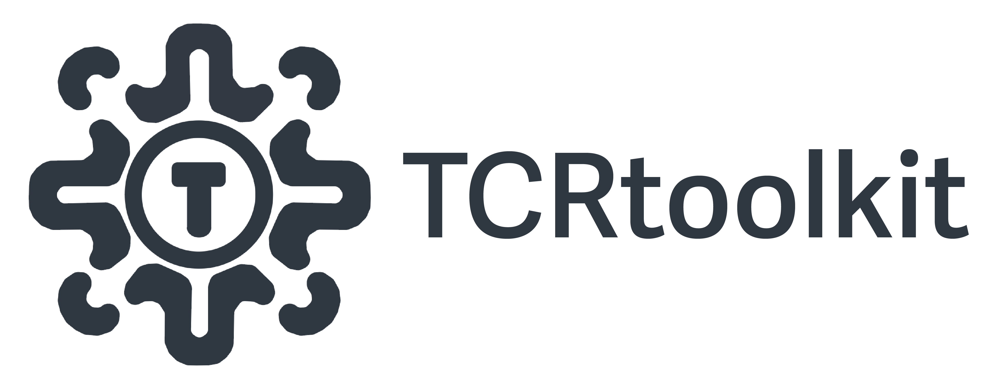

# TCRtoolkit-SC: scTCR repertoire analysis



Thanks for checking out `TCRtoolkit-SC`, a platform for single cell T Cell Repertoire analysis! `TCRtoolkit-SC` is wrapped in NextFlow, written in python, and uses Docker to manage dependencies.

We are currently working on developing a pipeline to take single cell TCRseq data and perform pseudobulk analysis similar to that of `TCRtoolkit-Bulk`.

##  Requirements

1. Nextflow

Nextflow can be used on any POSIX-compatible system (Linux, OS X, WSL). It requires Bash 3.2 (or later) and Java 11 (or later, up to 18) to be installed.

```{bash}
wget -qO- https://get.nextflow.io | bash
chmod +x nextflow
```

The nextflow executable is now available to run on the command line. The executable can be moved to a directory in your $PATH variable so you can run it from any directory.

2. Docker

`TCRtoolkit-SC` runs in Docker containers available [here](https://hub.docker.com/repository/docker/domebraccia/bulktcr/general). Depending on what operating system you are running (Linux, MacOS, WSL), please refer to the [Docker documentation](https://docs.docker.com/engine/install/) for installation instructions.

3. TCRtoolkit

```{bash}
git clone https://github.com/KarchinLab/TCRtoolkit-SC.git
cd TCRtoolkit-SC
```


## Quick Start

TBD